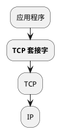
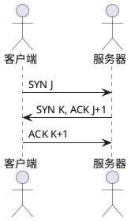
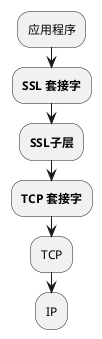
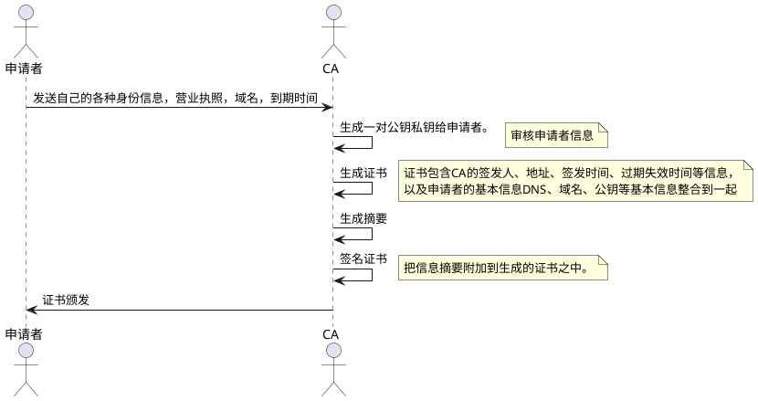
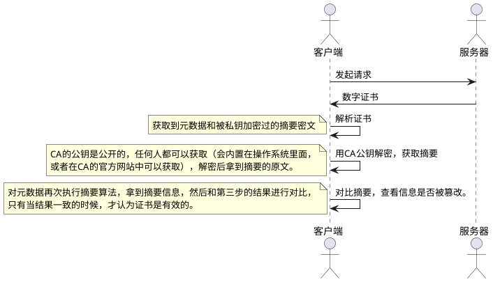

## 1 HTTP

概念
> Hypertext Transfer Protocol,超文本传输协议，是一个`基于请求与响应`，`无状态的`，`应用层的协议`，常基于TCP/IP协议传输数据，互联网上应用最为广泛的一种网络协议,所有的WWW文件都必须遵守这个标准。设计HTTP的初衷是为了提供一种发布和接收HTML页面的方法。

+ HTTP/0.9  不涉及数据包传输，规定客户端和服务器之间通信格式，只能GET请求
+ HTTP/1.0  传输内容格式不限制，增加PUT、PATCH、HEAD、 OPTIONS、DELETE命令
+ HTTP/1.1  持久连接(支持TCP长连接Keep-alive)复用连接通道、节约带宽、HOST域、管道机制、`分块传输编码`
+ HTTP/2    `多路复用`、服务器推送、头信息压缩、二进制协议等

#####长短连接
> HTTP协议是基于请求/响应模式的，因此只要服务端给了响应，本次HTTP连接就结束了，或者更准确的说，是本次HTTP请求就结束了，根本没有长连接这一说。那么自然也就没有短连接这一说了。
> 网络上说HTTP分为长连接和短连接，其实本质上是说的TCP连接。TCP连接是一个双向的通道，它是可以保持一段时间不关闭的，因此TCP连接才有真正的长连接和短连接这一说
> TCP长连接主要是多个http请求复用一个TCP连接，而不用每次请求过来都会新建一个TCP连接

##### TCP的三次握手

## 2 HTTPS

#### 443

#### 对称加密

#### 非对称加密

#### CA(Certificate Authority)

##### 数字证书的生成

##### 数字证书的验证

#### SSL/TLS
四次握手
1 Client Hello 
 + 支持的协议版本，比如 TLS 1.0 版
 + 一个客户端生成的随机数（`Client random`），稍后用于生成 “对话密钥”（Session Key）
 + 支持的加密方法，比如 RSA 公钥加密
 + 支持的压缩方法
2 Server Hello 
 + 确认使用的加密通信协议版本，比如 TLS 1.0 版本。如果浏览器与服务器支持的版本不一致，服务器关闭加密通信
 + 确认使用的加密方法(客户端所支持的)，比如 RSA 公钥加密
 + 将服务器证书、加密公钥、以及一个随机数（`Server random`）发送给客户端浏览器 
3 客户端回应
 + 检查证书是否已经过期
 + 检查证书中的域名与实际域名是否一致
 + 检查证书是否是可信机构颁布的
 >如果，上述过程中有任何一个环节发现问题，那么浏览器就会向访问者显示一个警告，由其选择是否还要继续通信。如果证书受信任，或者是用户接受了不受信的证书，浏览器会生成一串新的随机数（`Premaster secret` ），`并用证书中提供的公钥加密传输给服务器(防止被窃听)`。
 4 服务器的最后回应
 服务器收到客户端的第三个随机数（ Premaster secret） 之后，使用同样的算法计算出 “会话密钥” （Session Key）。

 整个握手阶段全部结束。接下来，客户端与服务器进入加密通信，就完全是使用普通的 HTTP 协议，只不过用 “会话密钥” 加密内容。（非对称加密解密将不再使用，接下来完全由对称加密接手了，因为密钥已经安全的传送给了通信的双方）

