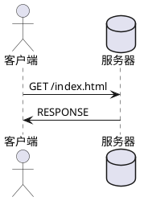
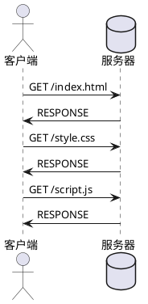
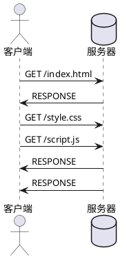

### 1 什么是多路复用 

#### http 1.0 (每个requeat建立一个tcp连接)

```plantuml
@startuml
actor 客户端
database 服务器
客户端 -> 服务器 : GET /index.html
服务器 -> 客户端 : RESPONSE
@enduml
``` 

#### http 1.1 (建立一个tcp连接, 串行化执行,会有阻塞), Keep-Alive

```plantuml
@startuml
actor 客户端
database 服务器
客户端 -> 服务器 : GET /index.html
服务器 -> 客户端 : RESPONSE
客户端 -> 服务器 : GET /style.css
服务器 -> 客户端 : RESPONSE
客户端 -> 服务器 : GET /script.js
服务器 -> 客户端 : RESPONSE
@enduml
``` 

#### http 2.0 

```plantuml
@startuml
actor 客户端
database 服务器
客户端 -> 服务器 : GET /index.html
服务器 -> 客户端 : RESPONSE
客户端 -> 服务器 : GET /style.css
客户端 -> 服务器 : GET /script.js
服务器 -> 客户端 : RESPONSE
服务器 -> 客户端 : RESPONSE
@enduml
``` 

### 传统的IO模型

### NIO模型

